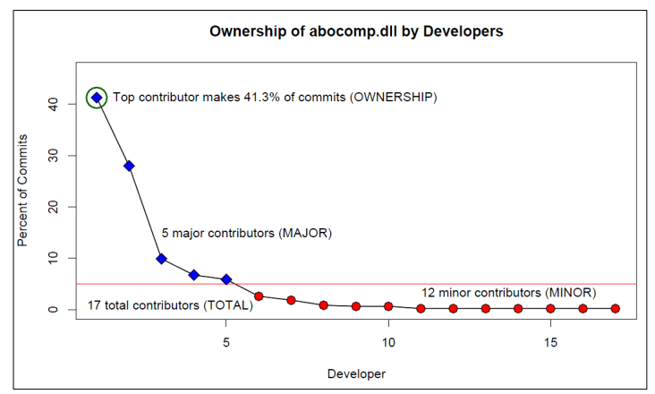

# Miksi versionhallinta on tärkeää ohjelmistokehityksessä

## Versionhallinnan hyödyt
- Muutosten seuranta - Mahdollistaa koodimuutosten tarkan seurannan ja aiempiin versioihin palaamisen
- Rinnakkainen kehitys - Useat kehittäjät voivat työskennellä samanaikaisesti ilman konflikteja
- Varmuuskopiointi - Koodin turvallinen säilytys palvelimella suojaa tietohäviöiltä
- Dokumentointi - Commit-viestit toimivat projektin historian dokumentaationa

## Miksi tehdä committeja usein
- Pienempi virheiden riski - Helpompi korjata ja löytää ongelmakohdat
- Yksinkertaisempi testaus - Pienemmät muutokset helpompi testata
- Tehokkaampi yhteistyö - Muutokset saatavilla tiimille nopeammin
- Helpompi regressioanalyysi - Mahdollistaa tarkan virheiden jäljityksen

Tutkimukset osoittavat, että säännöllinen kommitointi parantaa koodin laatua ja vähentää bugeja. Esimerkiksi Bird ym. (2011) toteavat, että tiheämpi kommitointi vähentää regressioiden määrää ohjelmistokehityksessä.

 
Kuva: Kaavio kehittäjien kehityssyklin aikana tekemien sitoumusten (commit) osuudesta erääseen järjestelmän kirjastoon. Kuvalähde: Bird ym. (2011)

## Luettavaa
- Bird ym. (2011). ["Don't Touch My Code!"](https://www.microsoft.com/en-us/research/wp-content/uploads/2016/02/bird2011dtm.pdf?msockid=0e9b734f117a60030a4266cc10bc6195)
- [Muutosten kommentointi](./muutosten_kommentointi.md)
- [About Git | GitHub Docs](https://docs.github.com/en/get-started/using-git/about-git)
