# Git Pull: Projektin historiaa ylläpitävä menetelmä

## Johdanto

Tämä ohje esittelee menetelmän projektin historian säilyttämiseksi käytettäessä git pull -komentoa.

## Skenaario

Oletetaan, että keskitetyssä repositoriossa on seuraava historia, joka päättyy muutokseen `A`:

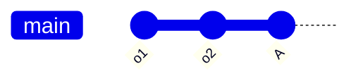
```
---o---o---A
```
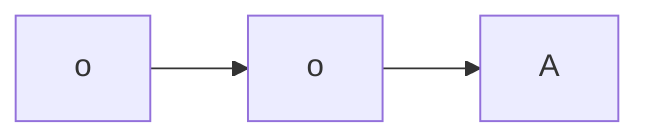

Kloonaat työalueen (repository) ja lisäät omia muutoksia (commit), mikä johtaa seuraavaan historiaan *omassa* työalueessasi:

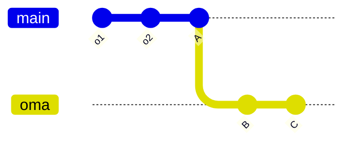

```
---o---o---A---B---C
```
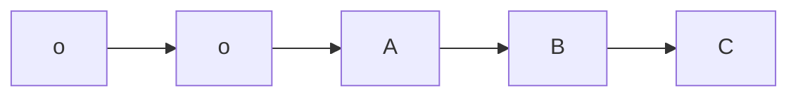

Samaan aikaan työkaverisi on tehnyt muutoksia versioon `A` *hänen* työtilassaan ja työntänyt ne keskitettyyn työalueeseen:

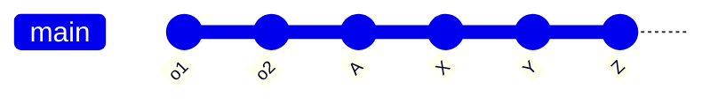
```
---o---o---A---X---Y---Z
```
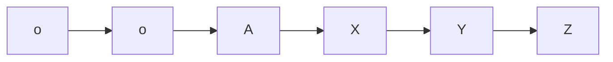

Jos yrität käyttää `git push` -komentoa tässä vaiheessa, se epäonnistuu, koska historiasi ei sisällä muutoksia `X`, `Y` ja `Z`.

Yksi tapa ratkaista ongelma on "nouda ja sitten yhdistä" (fetch and merge), eli `git pull`. Kun noudat muutokset, repositoriollasi on seuraavanlainen historia:"
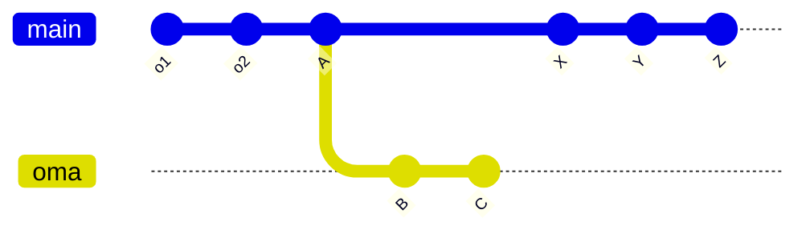

```
---o---o---A---B---C
            \
             X---Y---Z
```
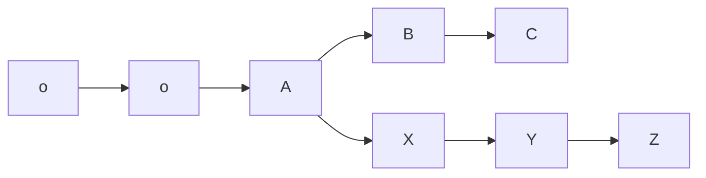

Kun yhdistät (merge) tämän jälkeen, kun edelleen olet *omassa* haarassasi eli `C`, luot yhdistelmän, joka näyttää seuraavanlaiselta:

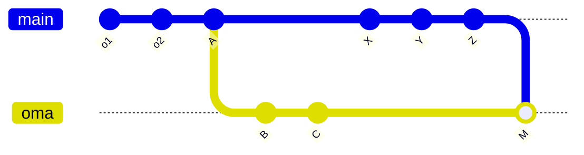


```
---o---o---A---B---C---M
            \         /
             X---Y---Z
```
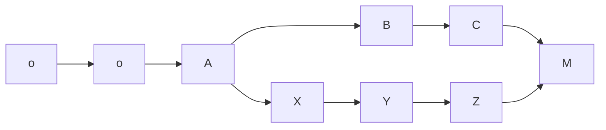

`M` on `Z`:n jälkeläinen, joten voit työntää sen (push) päivittääksesi keskusrepositorion. Tällainen yhdistäminen ei menetä yhtään muutosta kummassakaan historiassa, joten siinä mielessä se ei välttämättä ole väärin, mutta kun kehittäjät haluavat puhua "autoritatiivisesta kanonisesta historiasta, joka on jaettu projektin osallistujien kesken", eli "rungosta", he usein näkevät sen "muutoksina, jotka näet seuraamalla ensimmäisen vanhemman ketjua", ja käyttävät tätä komentoa nähdäkseen sen

```bash
git log --first-parent
```

Kaikille muille, jotka tarkastelivat keskusrepositiota sen jälkeen, kun työkaverisi työnsi `Z`:n mutta ennen kuin sinä työnsit `M`:n, rungon viimeinen muutos oli `o-o-A-X-Y-Z`. Koska kuitenkin loit `M`:n ollessasi `C`:ssä, `M`:n ensimmäinen vanhempi on `C`. Työntämällä `M`:n päivittääksesi keskusrepositorion, teit `X-Y-Z`:stä sivuhaaran, joka ei ole enää rungossa.

Tämän sijaan haluaisit mieluummin historian näyttävän seuraavanlaiselta:

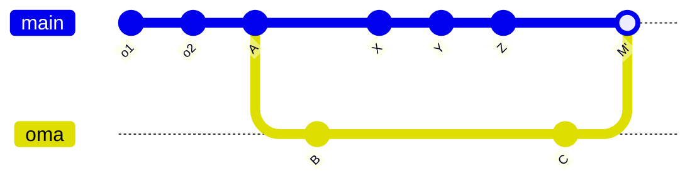

```
---o---o---A---X---Y---Z---M
            \             /
             B-----------C
```
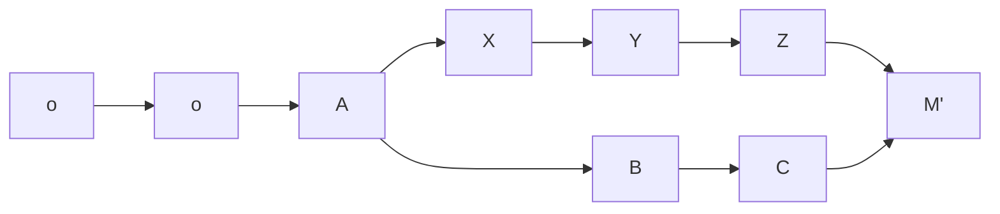

 
## Ratkaisuvaihtoehdot

Projektin version hallinnassa on useita ajattelutapoja:

1. **Täysin lineaarinen historia**
   - Jotkin projektit haluavat säilyttää täysin lineaarisen historian ilman yhtään yhdistämismuutosta (merge-commit)
   - Yhdistämisjärjestyksen vaihtaminen ei vastaa heidän makuaan
   - Tällöin tarvitsee tasoittaa historia päivitetyn lähdekoodin päälle, jotta historian saa muotoon:
     ```
     ---o---o---A---X---Y---Z---B---C
     ```
   - Tämä tehdään käyttämällä `git pull --rebase`-komentoa

2. **Yhdistämismuutosten salliva**
   - Jotkut projektit sallivat yhdistämismuutokset (merge-commit) historiassaan
   - Ei ole liian tarkka ensimmäisen vanhemman (first-parent) järjestyksestä
   - Sallii nopeasti etenevät yhdistämiset (fast-forward merging)
   - Yhdistämisjärjestyksen vaihtaminen ei vahingoita, mutta ei ole myöskään tarpeellista

3. **Yhden teeman projekti**
   - Jotkut projektit vaativat, että jokainen muutos päähaarassa ("trunk") tekee vain yhden asian
   - `git log --first-parent` näyttää joko:
     * Sivuhaarasta tehdyn muutoksen, joka täyttää yhden teeman
     * Yksittäisen muutoksen, joka itsessään täyttää yhden teeman
   - Jos muutokset `B` ja `C` ratkaisevat kaksi erillistä ongelmaa, aikaisemmin tehty yhdistäminen `M'` ei täytä projektin standardeja
   - Tällöin yhdistetään kaksi toisistaan riippumatonta työtä samanaikaisesti

## Suositeltu työnkulku (teemakohtainen lähestymistapa)

### Valmistelu

```bash
$ git clone $URL work && cd work
$ git checkout -b topic-b master
$ ... työvaiheet B0, B1 ja B2 yhden teeman valmiiksi saattamiseksi
$ git checkout -b topic-c master
$ ... sama toiselle teemalle
```

### Päivitys

```bash
$ git checkout master
$ git pull --ff-only
```

### Mergeäminen

```bash
$ git merge topic-b
$ git merge topic-c
```

### Käsittely Uusien Muutosten Ilmaantuessa

Jos keskitetyssä repositoriossa tapahtuu muutoksia kesken työskentelysi:

```bash
$ git reset --hard origin/master
$ git pull --ff-only
$ git merge topic-b
$ git merge topic-c
```

## Lisätietoja

Katso lisää Git-historian hallinnasta:
- [Git Blame Blog - Fun with First-Parent History](https://git-blame.blogspot.com/2013/09/fun-with-first-parent-history.html)

## Huomioitavaa

- Tärkeää on ymmärtää projektin käytännöt historian ylläpitämiseksi
- Eri projektit saattavat suosia erilaisia lähestymistapoja
- Kommunikaatio tiimin kesken on avainasemassa

## Suositeltu Työnkulku (Teemakohtainen Lähestymistapa)

### Valmistelu

```bash
$ git clone $URL work && cd work
$ git checkout -b topic-b master
$ ... työvaiheet B0, B1 ja B2 yhden teeman valmiiksi saattamiseksi
$ git checkout -b topic-c master
$ ... sama toiselle teemalle
```

### Päivitys

```bash
$ git checkout master
$ git pull --ff-only
```

### Mergeäminen

```bash
$ git merge topic-b
$ git merge topic-c
```

### Käsittely Uusien Muutosten Ilmaantuessa

Jos keskitetyssä repositoriossa tapahtuu muutoksia kesken työskentelysi:

```bash
$ git reset --hard origin/master
$ git pull --ff-only
$ git merge topic-b
$ git merge topic-c
```

## Lisätietoja

Katso lisää Git-historian hallinnasta:
- [Git Blame Blog - Fun with First-Parent History](https://git-blame.blogspot.com/2013/09/fun-with-first-parent-history.html)

## Huomioitavaa

- Tärkeää on ymmärtää projektin käytännöt historian ylläpitämiseksi
- Eri projektit saattavat suosia erilaisia lähestymistapoja
- Kommunikaatio tiimin kesken on avainasemassa