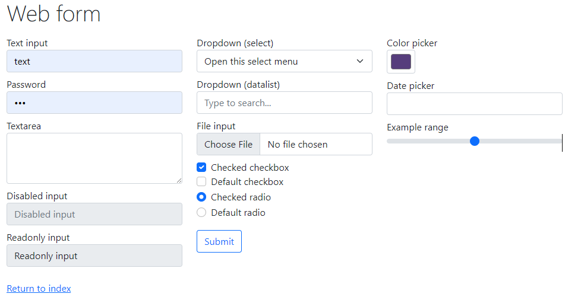
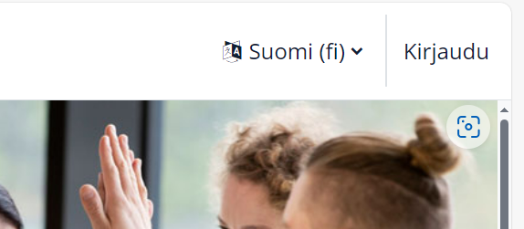

# 04. Browser library esimerkki

## Tausta ja tavoite
Tämän ohjeen tarkoitus on esitellä perusesimerkki, kuinka ottaa yhteys verkkosovellukseen ja käyttää resurssitiedostoja piilottamaan kirjautumissalasana. Tämä esimerkki on jatkokehitetty versio [Browser Libraryn 3. esimerkistä](https://robotframework-browser.org/#examples). Esimerkissä käytetään `Type Secret` avainsanaa piilotettujen käyttäjätietojen syöttämiseen verkkosivulle. Lisäksi opetuksillisista syistä selainikkuna jätetään testin jälkeen auki ja tietojen syöttämiseen on lisätty viiveitä, joita normaaleissa verkkosovellustesteissä ei tarvita. 

Esimerkissä käytetään testisivua: https://www.selenium.dev/selenium/web/web-form.html, mistä löytyy tyypillisimmät verkkosivujen visuaaliset ja interaktiiviset komponentit. Alla on kuvankaappaus testisivusta. 

## Keyword - tiedosto
Avaa uusi tiedosto, nimeä se `Keywords.robot` ja kirjoita tiedostoon seuraavat rivit

```robotframework
*** Variables ***
${Username}     somebody@example.com
${Password}     SuperSecret!
${Message}      Hello, Robot Framework!\nHow are you today?
```

## Testitapaus
Tee toinen tiedosto, nimeä se `browser_demo.robot` ja kopioi seuraavat rivit

```robotframework {.line-numbers}
*** Settings ***
Library     Browser    auto_closing_level=KEEP
Resource    Keywords.robot  

*** Test Cases ***
Test Web Form
    New Browser    chromium    headless=No  
    New Page       https://www.selenium.dev/selenium/web/web-form.html 
    Get Title      ==    Web form  
    Type Text      [name="my-text"]        ${Username}    delay=0.1 s 
    Type Secret    [name="my-password"]    $Password      delay=0.1 s
    Type Text      [name="my-textarea"]    ${Message}     delay=0.1 s
    Click With Options    button    delay=2 s
    Get Text       id=message    ==    Received!
```

Tämä koodi suorittaa testin Chromium-selaimella, avaa selaimen, lataa lomakkeen, täyttää kentät ja lähettää lomakkeen. Lopuksi tarkistetaan, että lomakkeen lähettäminen onnistui. Tässä on vielä lyhyet selitykset koodiriveille:

- ```Library     Browser    auto_closing_level=KEEP``` määrittää, että selain pysyy auki testin jälkeen.
- ```Resource    Keywords.robot``` viittaa ulkoiseen tiedostoon, joka sisältää määriteltyjä avainsanoja.
- ```New Browser    chromium    headless=No```  avaa uuden Chromium-selaimen ei-headless-tilassa, jolloin selainikkuna näkyy.
- ```New Page    https://www.selenium.dev/selenium/web/web-form.html```  avaa uuden välilehden ja lataa annetun URL-osoitteen.
- ```Get Title    ==    Web form```  tarkistaa, että sivun otsikko on "Web form".
- ```Type Text    [name="my-text"]    ${Username}    delay=0.1 s```  kirjoittaa tekstin nimellä "my-text" olevaan kenttään viiveellä.
- ```Type Secret    [name="my-password"]    $Password    delay=0.1 s```  kirjoittaa salasanan nimellä "my-password" olevaan kenttään viiveellä. **Huom! Normaali Robot Framework muuttujan käyttö  `${Password}` ei toimi, vaan salasana-muuttuja pitää antaa muodossa `$Password`.**
- ```Type Text    [name="my-textarea"]    ${Message}    delay=0.1 s```  kirjoittaa viestin nimellä "my-textarea" olevaan kenttään viiveellä.
- ```Click With Options    button    delay=2 s```  klikkaa nappia viiveellä.
- ```Get Text    id=message    ==    Received!```  tarkistaa, että elementin, jonka id on "message", teksti on "Received!".
 
## Aja testi
Aja testi antamalla terminaalissa komento
```Bash
robot browser_demo.robot
```

## Tehtävä
Sovella oheista esimerkkiä ja tee samanlainen testi omalle sovelluksellesi.

Huom! Oheisessa esimerkissä oletetaan, että kirjautumiskentät (username, password) löytyvät heti pääsivulta. Oma sovelluksesi voi vaatia ensiksi jonkin elementin valitsemista. Esimerkiksi [moodle.metropolia.fi](https://moodle.metropolia.fi) sivulla pitää ensiksi valita "Kirjaudu" -linkki, jonka jälkeen pääsee vasta kirjautumaan sisään palveluun. Tällöin koodiin pitää lisätä linkin valinta.




```robotframework
*** Test Cases ***
Test Web Form
    New Browser    chromium    headless=No  
    New Page       https://moodle.metropolia.fi 
    Get Title      ==    "Etusivu | Moodle"  
    Click          text = "Kirjaudu"
    ....
```

## Lisätietoa avainsanoista
- [Importing](https://marketsquare.github.io/robotframework-browser/Browser.html?tag=BrowserControl#Importing)
- [Browser, Context and Page](https://marketsquare.github.io/robotframework-browser/Browser.html?tag=BrowserControl#Browser%2C%20Context%20and%20Page)
- [Get Title](https://marketsquare.github.io/robotframework-browser/Browser.html?tag=BrowserControl#Get%20Title)
-  [Fill Text](https://marketsquare.github.io/robotframework-browser/Browser.html?tag=BrowserControl#Fill%20Text)
-  [Type Text](https://marketsquare.github.io/robotframework-browser/Browser.html?tag=BrowserControl#Type%20Text)
-  [Fill Secret](https://marketsquare.github.io/robotframework-browser/Browser.html?tag=BrowserControl#Fill%20Secret)
-  [Type Secret](https://marketsquare.github.io/robotframework-browser/Browser.html?tag=PageContent#Type%20Secret)
-  [Click](https://marketsquare.github.io/robotframework-browser/Browser.html?tag=BrowserControl#Click)
-  [Click With Options](https://marketsquare.github.io/robotframework-browser/Browser.html?tag=BrowserControl#Click%20With%20Options)

